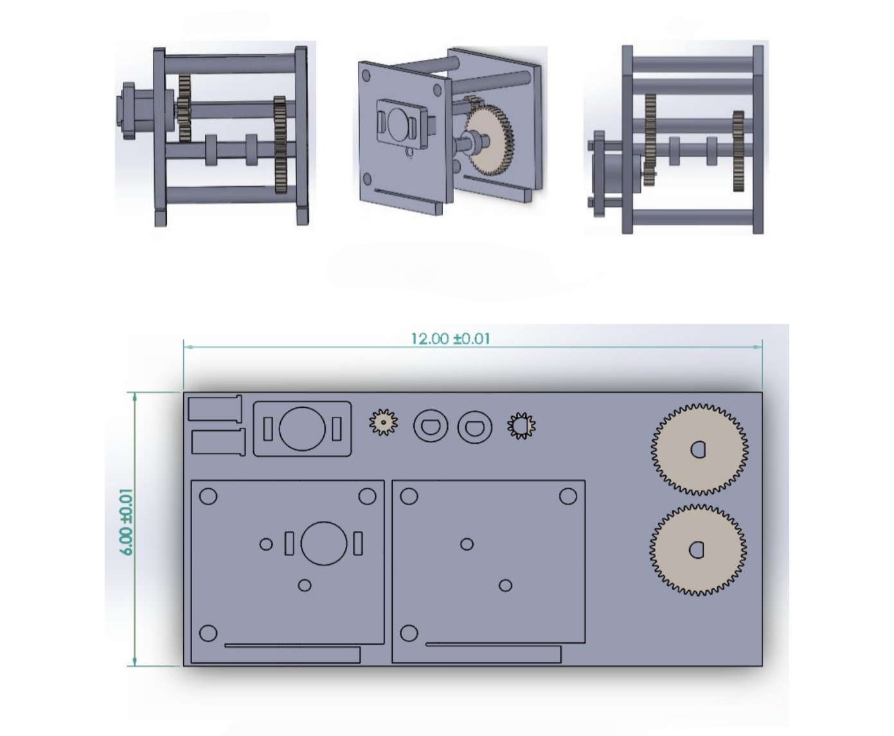

# ⚙️ Stress‑Optimized Compound Gearbox — Design & Static Analysis

## 📖 Overview
This project presents the **conceptual design** of a **four‑gear compound gearbox** in SOLIDWORKS, developed to lift a **1 kg mass up a 50 cm, 45° ramp**.  
A **static stress analysis** was conducted to optimize material usage while ensuring structural integrity under load.

Key features:
- **Four‑gear compound configuration** for efficient torque transmission
- **Stress‑optimized design** to minimize weight without compromising strength
- **Detailed CAD modeling** with precise tolerances
- **Static analysis** to validate safety factors and material selection

---

## 🛠 Skills & Tools
- **CAD & Simulation:** SOLIDWORKS (part & assembly modeling, static stress analysis)
- **Mechanical Design:** Gear trains, power transmission systems
- **Engineering Analysis:** Load calculations, safety factor evaluation
- **Project Management:** Research, documentation, presentation

---

## 📄 Documentation
- [Design Report](docs/compound_gearbox.pdf)
- [2D Drawing](images/compound_gearbox_gallery/2D/2d_drawings.jpg)
- [More 2D Drawings](images/compound_gearbox_gallery/2D/)
- [CAD Assembly File](files/cad/compound_gearbox/Gearbox.Design.SLDASM)
- [Stress Analysis Results](images/compound_gearbox_gallery/results/)

---

## 📸 Gallery
  
*Technical drawing of the gearbox assembly.*

  
*Static stress distribution under operational load.*

---

## 🔬 Design Highlights
1. **Optimized Gear Ratio** — Balanced torque and speed for the target load and incline.
2. **Material Efficiency** — Reduced mass while maintaining structural integrity.
3. **Precision CAD Modeling** — Accurate gear profiles and assembly constraints.
4. **Validated Performance** — Static analysis confirms safe operation under design load.

---

## 🚀 Potential Applications
- Educational demonstrations of gear train mechanics
- Small‑scale lifting mechanisms
- Robotics and automation systems
- Mechanical design coursework and research

---
